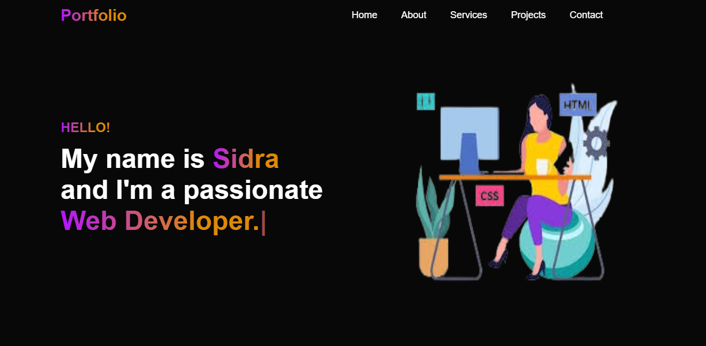
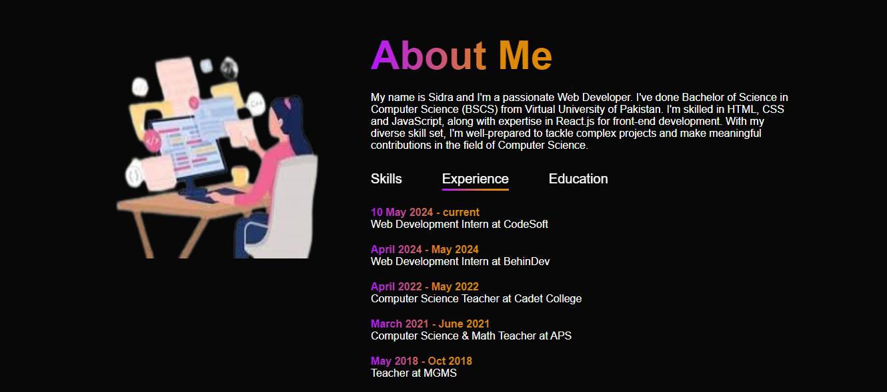
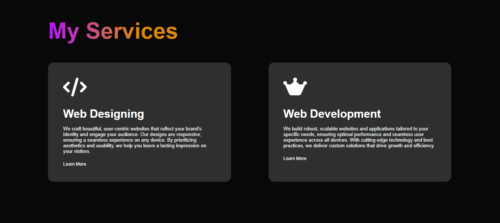
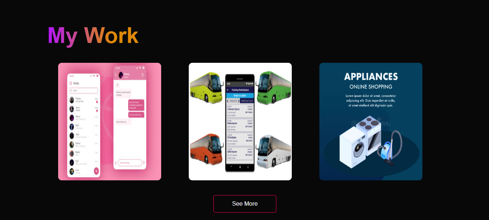
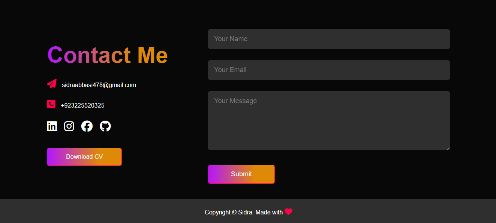

# Personal Portfolio Website

A personal portfolio website built using HTML, CSS, and JavaScript. This project was developed as part of my internship at CodeSoft.

## Key Features

- **Responsive Design**: Fully responsive design that looks great on all devices.
- **Interactive Elements**: Smooth scrolling, animations, and interactive buttons.
- **Home Section**: Welcoming section with an introduction and call-to-action.
- **About Me Section**: A section to introduce yourself and your skills.
- **Services Section**: Detailed overview of the services you offer.
- **Projects Showcase**: Dedicated section to showcase your projects with images and descriptions.
- **Contact Form**: Functional contact form for visitors to reach out.

## Screenshots

### Screenshot-01

### Screenshot-02

### Screenshot-03

### Screenshot-04

### Screenshot-05

## Technologies Used

- **HTML**: For the structure of the website.
- **CSS**: For styling and layout.
- **JavaScript**: For interactivity and dynamic content.
